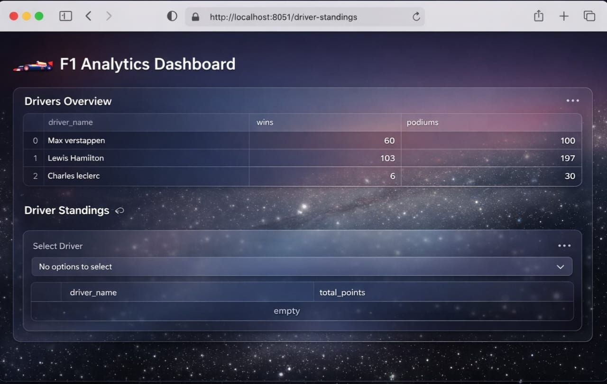

# 🏎️ F1 Analytics Database Project...

  A structured **Formula 1 analytics database** designed to store, analyze, and visualize race, driver, team, and performance data.This project is ideal for **SQL practice, analytics dashboards, and Backend integration, python, streamlit**.
Season-wise performance dashboards built using **MySQL + Python + Streamlit**.

---


## 📊 Dashboard Preview



---


## 🗂️ Project Structure

```
f1-analytics/
│
├── database/
│   ├── schema.sql      # Tables, indexes, views
│   ├── seed.sql        # Sample data inserts
│   ├── queries.sql     # Analytics queries
│
├── README.md
└── .gitignore
```

---

## 🧱 Database Highlights...

* **Teams & Drivers** – championships, wins, podiums
* **Races & Circuits** – season-based race tracking
* **Lap Times** – per-lap performance analysis
* **Pit Stops** – tyre compound & duration insights
* **Tyre Stints** – strategy-level data
* **Qualifying Results** – Q1/Q2/Q3 performance
* **Views** for driver & team standings some more available in future 

---

## What I Learned..
- Designing a relational database using MySQL
- Writing analytical SQL queries with joins and aggregations
- Connecting MySQL with Python
- Performing data analysis using Pandas
- Visualizing data with Matplotlib
- Building an interactive dashboard using Streamlit


## 📊 Key Analytics Supported...

* Driver standings by total points
* Team championship standings
* Fastest laps per driver
* Average pit stop duration
* Tyre compound usage trends
* Season-wise performance dashboards

---


## 🚀 How to Use

1. Create the database and schema

   ```sql
    source database/schema.sql;
   ```

2. Insert sample data

   ```sql
    source database/seed.sql;
   ```

3. Run analytics queries

   ```sql
    source database/queries.sql;
   ```
4. Connect database with Python
    ```  Update credentials in
     python/db_connect.py
    ```

5. Run the dashboard
    ``` Launch Streamlit dashboard 
     python/dashboard.py
    ```

---

## 🛠️ Tech Stack...

* **Database:** MySQL
* **Database connectivity:** python, streamlit
* **Design:** Relational schema (3NF)
* **Use Cases:** SQL analytics, dashboards, backend APIs

---

## 🌱 Future Enhancements...

* Add season-wise points calculation
* Integrate with Django REST API
* Power BI / Tableau dashboards
* Real-time race data ingestion
* Advanced SQL (CTEs, window functions)

---

## 👤 Author

**ANUROOP**
<p>Aspiring backend & data-focused developer with an interest in real-world system design and analytics.</p>  

---

⭐ If you like this project, consider starring the repo!


